  

  
  

  Ücretsiz · açık kaynak · Windows 10 / 11 ve macOS 14+ · Türkçe ve İngilizce

 

  

Araç kutusunda ayrıca **büyük dosya bulucu**, **dosya parçalayıcı**, **geçmiş ve gizlilik temizliği**, **kanıt temizleyici**, **yedek yöneticisi**, **kurulum izleyici**, **tarayıcı eklentileri** ve **Windows (Store / MSIX) uygulamaları** var.

 

  
   <b>Windows 10 / 11</b> — panel · sistem izleyici · gereksiz dosyalar · kalıntılar · araçlar · hakkında

 

  
   <b>macOS 14+</b> (Apple Silicon ve Intel) — panel · uygulamalar · kalıntılar · gereksiz dosyalar · sistem izleyici

 

| Bilgisayarın | Dosya | |
|---|---|---|
| **Windows 10 / 11** | [Oblivion-3.1.0-Windows-Setup.exe](https://github.com/anilg12/Oblivion-Uninstaller/releases/latest/download/Oblivion-3.1.0-Windows-Setup.exe) | Kurulum sihirbazı — önerilen |
| Windows, kurulumsuz | [Oblivion-3.1.0-Windows-Portable.exe](https://github.com/anilg12/Oblivion-Uninstaller/releases/latest/download/Oblivion-3.1.0-Windows-Portable.exe) | Tek dosya, çift tıkla çalışır |
| **Mac — Apple Silicon** | [Oblivion-3.1.0-macOS-AppleSilicon.dmg](https://github.com/anilg12/Oblivion-Uninstaller/releases/latest/download/Oblivion-3.1.0-macOS-AppleSilicon.dmg) | M1, M2, M3, M4 ve sonrası |
| **Mac — Intel** | [Oblivion-3.1.0-macOS-Intel.dmg](https://github.com/anilg12/Oblivion-Uninstaller/releases/latest/download/Oblivion-3.1.0-macOS-Intel.dmg) | Intel işlemcili Mac'ler |
| Mac — emin değilim | [Oblivion-3.1.0-macOS-Universal.dmg](https://github.com/anilg12/Oblivion-Uninstaller/releases/latest/download/Oblivion-3.1.0-macOS-Universal.dmg) | Her Mac'te çalışır |

**Windows:** Setup dosyasını çalıştır ve sihirbazı takip et. Önceki sürüm kuruluysa yerinde güncellenir.
**Mac:** DMG'yi aç ve Oblivion'u **Uygulamalar** klasörüne sürükle. En iyi sonuç için Oblivion'a **Tam Disk Erişimi** ver; uygulamanın içinde bunu açan bir düğme var.

Tüm sürüm notları [Sürümler](https://github.com/anilg12/Oblivion-Uninstaller/releases/latest) sayfasında.

 

<b>Güvenlik ilkeleri</b>

 

- **Hiçbir şey senin yerine seçilmez**, ne kalıntılar ne gereksiz dosyalar. İstersen tek tıkla yalnızca “kesin” eşleşmeleri seçebilirsin.
- **Her silmeden önce onay** istenir; etkilenecek dosya ve kayıtların tam listesi gösterilir.
- **Korunan konumlar asla listelenmez:** Windows, Microsoft ve Apple klasörleri ile başka programlarla paylaşılan klasörler.
- **Geri dönüş yolu:** Windows'ta isteğe bağlı sistem geri yükleme noktası ve Geri Dönüşüm Kutusu, Mac'te Çöp Sepeti.

<b>Sık sorulan sorular</b>

 

**Windows “bilgisayarınızı korudu” diyor.** Oblivion ücretli bir kod imzalama sertifikası taşımadığı için Windows yeni programlarda bu ekranı gösterebilir. **Ek bilgi → Yine de çalıştır**'a bas.

**Mac “geliştirici doğrulanamadı” diyor.** **Sistem Ayarları → Gizlilik ve Güvenlik → Yine de Aç**'a bas.

**Hangi Mac dosyasını indirmeliyim?** Elma menüsü → Bu Mac Hakkında'da “Çip: Apple M…” yazıyorsa Apple Silicon, “İşlemci: Intel” yazıyorsa Intel. Emin değilsen Universal her Mac'te çalışır.

<b>Kaynaktan derleme</b>

 

| | |
|---|---|
| **Windows** | `build.bat` dosyasına çift tıkla. .NET 8 SDK yoksa yerel olarak kurulur. Çıktı `dist\` klasörüne gider (kurulum dosyası için Inno Setup 6 gerekir). |
| **macOS** | macOS 14+ ve Xcode 15+ ile: `cd macos && ./build-mac.sh`. Apple Silicon, Intel ve Universal DMG'ler `macos/build/` klasörüne çıkar. |

Her değişiklikte GitHub Actions iki platformda da uygulamayı açar, her sayfanın ekran görüntüsünü alır ve hiçbir şeyin önceden seçilmediğini, korunan konumların önerilmediğini doğrular. Yayımlanan kurulum dosyası da her sürümde indirilip kurularak denenir.

<b>English</b>

 

**Oblivion** removes programs without a trace, cleans your computer safely and shows your system live — on Windows 10 / 11 and macOS 14+ (Apple Silicon and Intel).

- **Clean uninstalls** — runs the program's own uninstaller, then finds leftovers in the file system and registry (`~/Library` and `/Library` on a Mac), each with the reason it was found and a confidence level.
- **Live system monitor** — CPU, memory, CPU temperature, network, disks, battery and the busiest processes.
- **Safe cleaning** — nothing is pre-selected; every file is listed and only what you tick is removed, after a confirmation with the full list.
- **Hunter mode, startup manager, install monitor, browser extensions**, plus large files, file shredder, history & privacy, evidence remover and backup manager.
- **Safety first** — Windows, Microsoft, Apple and shared locations are never offered, and there is always a way back (restore point / Recycle Bin / Trash).

Download the Windows installer or the Mac DMG with the buttons at the top, or pick a file from the table above. To build from source: double-click `build.bat` on Windows, or run `cd macos && ./build-mac.sh` on a Mac.

 

### Geliştirici

Projelerim ve hakkımda daha fazla bilgi için kişisel web siteme göz atabilirsiniz.

  

© 2026 ANIL GÜL · MIT lisansı

