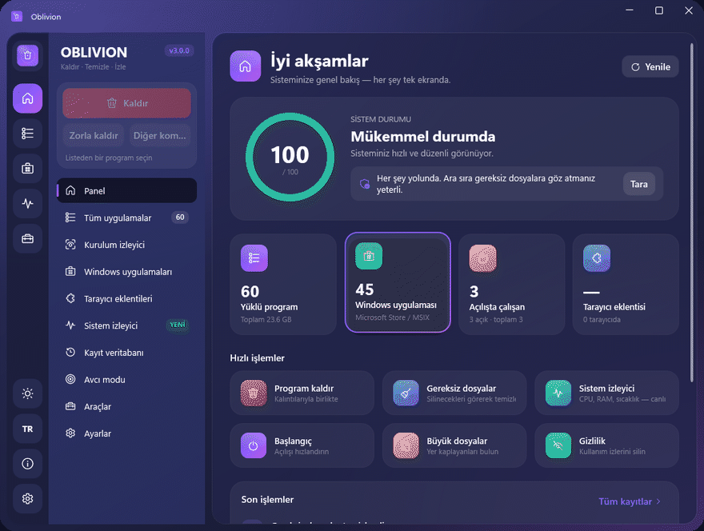
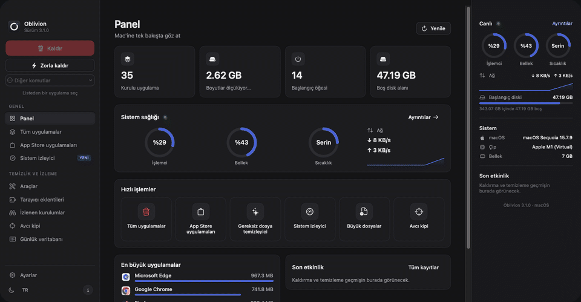

<p align="center">
  
</p>

<p align="center">
  <a href="https://github.com/anilg12/Oblivion-Uninstaller/releases/latest"></a>
  <a href="https://github.com/anilg12/Oblivion-Uninstaller/releases"></a>
  
  
  
  <a href="LICENSE"></a>
</p>

<h3 align="center">Programları iz bırakmadan kaldır · bilgisayarını güvenle temizle · sistemini canlı izle</h3>

<p align="center">
  <a href="#indir"></a>
  &nbsp;
  <a href="#indir"></a>
</p>

<p align="center"></p>

## 🎬 Bir bakışta

<p align="center">
  
  <br><sub>🪟 <b>Windows 10 / 11</b> — panel · sistem izleyici · gereksiz dosyalar · kalıntılar · araçlar · hakkında</sub>
</p>

<p align="center">
  
  <br><sub>🍏 <b>macOS 14+</b> (Apple Silicon ve Intel) — panel · sistem izleyici · gereksiz dosyalar · onay · kalıntılar · hakkında</sub>
</p>

<p align="center"></p>

## ✨ Neler yapar?

<table>
<tr>
<td width="50%" valign="top">

### 🗑️ İz bırakmadan kaldırma
Programı kendi kaldırıcısıyla kaldırır, ardından **dosya sistemi ve kayıt defterindeki** (Mac'te `~/Library` ve `/Library`) kalıntıları bulur. Her kalıntının **neden bulunduğu** ve **ne kadar emin olunduğu** yazar.

</td>
<td width="50%" valign="top">

### 📊 Canlı sistem izleyici <sup>YENİ</sup>
İşlemci, bellek, **işlemci sıcaklığı**, ağ hızı, diskler, pil sağlığı ve en çok kaynak kullanan işlemler. Her saniye güncellenir, sayfa kapalıyken kaynak tüketmez.

</td>
</tr>
<tr>
<td valign="top">

### 🧹 Güvenli gereksiz dosya temizleyici <sup>YENİ</sup>
**Hiçbir şey otomatik seçilmez.** Her kategori açılır ve silinecek her dosya tek tek görünür. Yalnızca senin işaretlediklerin, tam listeyle onay verdikten sonra silinir.

</td>
<td valign="top">

### 🎯 Avcı modu
Nişangâhı herhangi bir pencerenin üzerine sürükle (Mac'te pencereye tıkla). Oblivion programı bulur; kapatabilir, klasörünü açabilir ya da kaldırabilirsin.

</td>
</tr>
<tr>
<td valign="top">

### 🚀 Başlangıç yöneticisi
Açılışta çalışan programları **silmeden kapat**, istediğinde yeniden aç.

</td>
<td valign="top">

### 🔭 Kurulum izleyici
Kurulumdan önce sistemin anlık görüntüsünü al, sonra karşılaştır: programın eklediği her şeyi gör ve kaldır.

</td>
</tr>
<tr>
<td valign="top">

### 🧩 Tarayıcı eklentileri
Chrome, Edge, Brave, Opera, Vivaldi, Arc, Firefox (ve Safari) eklentileri tek ekranda.

</td>
<td valign="top">

### 🛠️ Araç kutusu
Büyük dosyalar · Dosya parçalayıcı · Geçmiş ve gizlilik · Kanıt temizleyici · Yedek yöneticisi · Windows uygulamaları (Store / MSIX)

</td>
</tr>
</table>

### 🛡️ Güvenlik ilkeleri

> - **Hiçbir şey senin yerine seçilmez**, ne kalıntılar ne gereksiz dosyalar. İstersen tek tıkla yalnızca “kesin” eşleşmeleri seçebilirsin.
> - **Her silmeden önce onay** istenir; etkilenecek dosya ve kayıtların tam listesi gösterilir.
> - **Korunan konumlar asla listelenmez**: Windows, Microsoft ve Apple klasörleri, başka programlarla paylaşılan klasörler.
> - **Geri dönüş yolu**: Windows'ta isteğe bağlı sistem geri yükleme noktası ve Geri Dönüşüm Kutusu, Mac'te silinenler önce Çöp Sepeti'ne gider.

<p align="center"></p>

<a name="indir"></a>

## ⬇️ İndir

### 🪟 Windows — önerilen kurulum (uyarısız)

**PowerShell**'i aç (Başlat'a `PowerShell` yaz), şu satırı yapıştır ve Enter'a bas:

```powershell
irm https://raw.githubusercontent.com/anilg12/Oblivion-Uninstaller/main/install.ps1 | iex
```

En yeni sürümü GitHub'dan indirip kurulum sihirbazını açar. Bu yolla kurulan dosyalar “internetten indirildi” olarak işaretlenmediği için **“Windows kişisel bilgisayarınızı korudu” (SmartScreen) uyarısı çıkmaz**. Yalnızca programları kaldırabilmek için gereken standart yönetici izni sorulur.

### 🍏 Mac — önerilen kurulum (uyarısız)

**Terminal**'i aç, şu satırı yapıştır ve Enter'a bas. Mac'inin işlemcisine (Apple Silicon / Intel) uygun sürümü kendisi seçer:

```bash
curl -fsSL https://raw.githubusercontent.com/anilg12/Oblivion-Uninstaller/main/macos/install-mac.sh | bash
```

### 📦 Ya da dosyayı elle indir

| Bilgisayarın | Dosya |
|---|---|
| 🪟 **Windows 10 / 11** (önerilen) | [`Oblivion-3.0.0-Windows-Setup.exe`](https://github.com/anilg12/Oblivion-Uninstaller/releases/latest/download/Oblivion-3.0.0-Windows-Setup.exe) — kurulum sihirbazı |
| 🪟 Windows, kurulumsuz | [`Oblivion-3.0.0-Windows-Portable.exe`](https://github.com/anilg12/Oblivion-Uninstaller/releases/latest/download/Oblivion-3.0.0-Windows-Portable.exe) — tek dosya, çift tıkla çalışır |
| 🍏 **Mac — Apple Silicon** (M1, M2, M3, M4…) | [`Oblivion-3.0.0-macOS-AppleSilicon.dmg`](https://github.com/anilg12/Oblivion-Uninstaller/releases/latest/download/Oblivion-3.0.0-macOS-AppleSilicon.dmg) |
| 🍏 **Mac — Intel işlemcili** | [`Oblivion-3.0.0-macOS-Intel.dmg`](https://github.com/anilg12/Oblivion-Uninstaller/releases/latest/download/Oblivion-3.0.0-macOS-Intel.dmg) |
| 🍏 Mac — hangisi olduğundan emin değilim | [`Oblivion-3.0.0-macOS-Universal.dmg`](https://github.com/anilg12/Oblivion-Uninstaller/releases/latest/download/Oblivion-3.0.0-macOS-Universal.dmg) — her Mac'te çalışır |

<details>
<summary>🍏 <b>DMG ile Mac'e kurulum</b></summary>

 Oblivion'u **Applications** klasörüne sürükle. İlk açılışta “geliştirici doğrulanamadı” uyarısı çıkarsa **Sistem Ayarları → Gizlilik ve Güvenlik → Yine de Aç**'a bas. En iyi sonuç için Oblivion'a **Tam Disk Erişimi** ver (uygulamanın içinde bunu açan bir düğme var).

</details>

<details>
<summary>🪟 <b>Setup.exe ile Windows'a kurulum</b> — neden uyarı çıkabilir?</summary>

`Oblivion-3.0.0-Windows-Setup.exe` dosyasını çalıştır ve sihirbazı takip et. Önceki sürüm kuruluysa yerinde güncellenir.

Tarayıcıyla indirilen ve ücretli bir kod imzalama sertifikası taşımayan her yeni program için Windows, **“Windows kişisel bilgisayarınızı korudu”** uyarısını gösterir; bu uyarı programın zararlı olduğu anlamına gelmez. Bu uyarıyı hiç görmemek için yukarıdaki **tek satırlık PowerShell kurulumunu** kullan. Dosyayı yine de elle indirdiysen: **Ek bilgi → Yine de çalıştır**.

</details>

<p align="center"></p>

## 🆕 3.0'da neler yeni

- 📊 **Canlı Sistem İzleyici**: işlemci, bellek, sıcaklık, ağ, diskler, pil ve en yoğun işlemler (Windows ve Mac).
- 🧹 **Gereksiz dosya temizleyici baştan yazıldı**: otomatik seçim yok, her dosya görünür, silmeden önce tam listeyle onay.
- 🛡️ **Kalıntılar asla otomatik işaretlenmez.** Microsoft / Apple ve paylaşılan klasörler hiç önerilmez.
- ⏯️ Başlangıç öğeleri **silinmeden kapatılıp açılabilir**.
- ℹ️ Geliştirici imzası ana ekrandan kaldırıldı, **ⓘ Hakkında** penceresine taşındı.
- ⚡ **Windows'ta sonraki açılışlardaki kasma giderildi**: açılış 1 saniyenin altında, sayfa geçişleri 0,25 saniyenin altında (CI ölçümü).
- 🧠 **Mac için Apple Silicon ve Intel'e ayrı yerel derlemeler.** Sıcaklık Apple Silicon'da işlemci sensörlerinden, Intel'de SMC'den okunur.
- 🎞️ Daha fazla animasyon ve efekt; pencere gizliyken dururlar. İstersen **Hareketi azalt** ile kapatabilirsin.

Ayrıntılar için [sürüm notlarına](https://github.com/anilg12/Oblivion-Uninstaller/releases/latest) bak.

## 💻 Kaynaktan derleme

| | |
|---|---|
| 🪟 **Windows** | `build.bat` dosyasına çift tıkla. .NET 8 SDK yoksa yerel olarak kurulur. Çıktı `dist\` klasörüne gider (kurulum dosyası için Inno Setup 6 gerekir). |
| 🍏 **macOS** | macOS 14+ ve Xcode 15+ ile: `cd macos && ./build-mac.sh`. Apple Silicon, Intel ve Universal DMG'ler `macos/build/` klasörüne çıkar. |

Her değişiklikte GitHub Actions iki platformda da uygulamayı açar, her sayfanın ekran görüntüsünü alır ve hiçbir şeyin önceden seçilmediğini, korunan konumların önerilmediğini doğrular. Mac testi hem Apple Silicon hem Intel makinede çalışır.

<details>
<summary>🇬🇧 <b>English</b></summary>

### Oblivion — uninstaller & system cleaner for Windows and macOS

Remove programs without a trace, clean your computer safely and watch your system live.

- 🗑️ **Clean uninstalls**: runs the program's own uninstaller, then finds leftovers in the file system and registry (on a Mac, `~/Library` and `/Library`), each with the reason it was found and a confidence level.
- 📊 **Live System Monitor** *(new)*: CPU, memory, **CPU temperature**, network, disks, battery health and the busiest processes. It costs nothing while closed.
- 🧹 **Safe junk cleaner** *(new)*: **nothing is pre-selected**. Every category opens to show each file, and only what you tick is removed, after a confirmation with the full list.
- 🎯 **Hunter mode**, 🚀 **Startup manager** (switch items off without deleting them), 🔭 **Install monitor**, 🧩 **Browser extensions**, 🛠️ Large files · File shredder · History & privacy · Evidence remover · Backup manager · Windows (Store / MSIX) apps.
- 🛡️ **Safety first**: nothing is ever ticked for you, every deletion is confirmed with the exact list, Windows / Microsoft / Apple and shared locations are never offered, and there is a way back (an optional restore point and the Recycle Bin on Windows, the Trash on a Mac).

**Recommended Windows install (no SmartScreen prompt):** open PowerShell and run

```powershell
irm https://raw.githubusercontent.com/anilg12/Oblivion-Uninstaller/main/install.ps1 | iex
```

It downloads the latest setup and starts it. Files fetched this way aren't marked as downloaded from the internet, so the “Windows protected your PC” screen doesn't appear (the browser-downloaded Setup.exe shows it because it isn't signed with a paid code-signing certificate).

**Downloads:** the Windows installer or portable exe, and Mac DMGs for **Apple Silicon**, **Intel** or **Universal** (see the table above). One-line Mac install, which picks the right build and skips the Gatekeeper prompt:

```bash
curl -fsSL https://raw.githubusercontent.com/anilg12/Oblivion-Uninstaller/main/macos/install-mac.sh | bash
```

**Build:** on Windows, double-click `build.bat`. On macOS, run `cd macos && ./build-mac.sh` (macOS 14+, Xcode 15+).

</details>

---

## 👨‍💻 Geliştirici

Projelerim ve hakkımda daha fazla bilgi edinmek için kişisel web siteme göz atabilirsiniz:

[](https://anilg12.github.io/)

> **Önizleme:**
> [](https://anilg12.github.io/)
